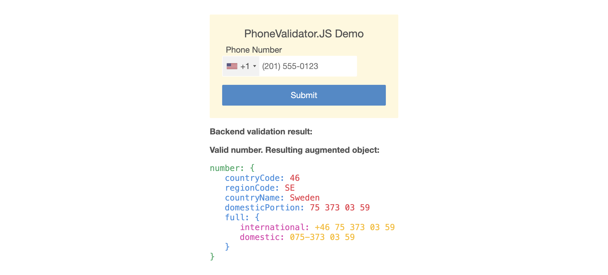

## PhoneValidator.JS - Frontend and backend validation in tandem

### Three lines front-end and two lines back-end.
> You get frontend and backend validation working together, a color toggle for valid/invalid number, and the resulting formatted domestic and international number plus full country name, country code and region code.

**PhoneValidator.JS** is a wrapper for both frontend and backend validation of international phone numbers using up-to-date existing libraries. Front-end as-you-type validation is done via [intl-tel-input](https://github.com/jackocnr/intl-tel-input), and backend validation and formatting is done via [google-libphonenumber](https://github.com/ruimarinho/google-libphonenumber) for Node. The two libraries are wrapped in the class ```PhoneValidator``` for the backend and ```PhoneValidatorFE``` for the frontend.

Aside from tying the libraries together in a plug-and-play fashion, **PhoneValidator.JS** adds a few small extra features, such as toggling of the input field background color for valid/invalid, which you may disable, and back-end it returns country name among other properties in the augmented ```number``` object.

**Three lines front-end**
```javascript
const htmlIds = { formId: 'formId', inputFieldId: 'inputId' };
```
The following line also adds the hidden fields ```countryCode``` & ```domesticPortion```.
```javascript
let phoneValidator = new PhoneValidatorFE(htmlIds);
```
Lastly, in your form validation, call:
```javascript
if(phoneValidator.validNumber()) {
```

**Two lines back-end**
```javascript
let number = { countryCode: req.body.countryCode, domesticPortion: req.body.domesticPortion };

if(PhoneValidator.isPhoneNumber(number)) {
```
If valid, the ```number``` object now contains for instance:
```javascript
{
  countryCode: '46',
  regionCode: 'SE',
  countryName: 'Sweden',
  domesticPortion: '8 59 67 27',
  full: {
    international: '+46 8 59 67 27',
    domestic: '08-59 67 27'
  }
};
```

Example when the phone number is positively validated by the frontend class ```PhoneValidatorFE``` - **the input field background is included in the JS toggle, all other CSS styling is custom for the demo**:


Resulting object augmented by the backend class ```PhoneValidator``` upon positive validation - **returning to the frontend just for the demo**:



**Brief setup instructions - [Or go to detailed instructions](#detailed-instructions)**

**1** Download **PhoneValidator.JS** and put ```src/phoneValidator/``` in your src directory for the backend, and put the ```public/phoneValidatorFE/``` in your public directory for the frontend. Include the two classes where you will use them.

**2** Install [google-libphonenumber](https://github.com/ruimarinho/google-libphonenumber) for the backend via ```npm install --save-prod google-libphonenumber```, and download [intl-tel-input](https://github.com/jackocnr/intl-tel-input) for the frontend and put in a public directory. The required files are: ```build/css/intlTelInput.min.css```, ```build/img/flags.png```, ```build/img/flags@2x.png```, ```build/js/data.min.js```, ```build/js/intlTelInput.min.js``` and ```build/js/utils.js```.

**3** Include the ```intelTelInput.min.js``` script and the ```intelTelInput.min.css``` file. Set correct paths to ```flags.png``` and ```flags@2x.png``` in the ```intlTelInput.min.css``` file, and check that the path to ```utils.js``` is correct in ```PhoneValidatorFE```.

## Why PhoneValidator.JS

- It took me some time to get the two libraries to work well in tandem, so I figured it could save some people a bit of time to have a working implementation that can be used with just a few lines.

- It makes sense to both validate front-end (blocking the sending of the form if the phone number is invalid) and back-end (so as not to store invalid phone numbers in your database).

- A few things have also been added front-end:

  - Mainly a graphical toggle alternating the background color of the phone number input field. It is on by default, with a transition, but you may deactivate it by providing the object ```options = {toggleColors: false}``` as a second argument to the ```PhoneValidatorFE``` constructor. You may change the default colors if you like, also via the ```options``` object, and you may deactivate or alter the transition. The full options you may use are defined later on this page.

  - The input field now also removes double blankspace and leading whitespace, and before a valid phone number is sent back-end trailing whitespace is also removed.

- A few things have also been added back-end, such as returning not only the full formatted number, but also country name (e.g. ```Sweden```), country code (e.g. ```1``` for America), and region code (e.g. ```US```, ```CA``` or ```VA```). Some countries or geographical areas, such as America, the UK and Australia, have several region codes for a single numeric country code, the correct one getting returned depending on the domestic number provided.

  - Also, back-end the parser crashes execution if an invalid number is provided, so we catch that and instead return ```false``` if the number is invalid.

### Terms for different codes

- The official term for region code is "ISO 3166-1 alpha-2 country codes".
- Other terms for country code are "Country Calling Code" or "Country Dial-In Code".

### "Domestic number" vs. "domestic portion"

Different countries have different rules for how numbers must start when called domestically, which is why ```number.domesticPortion``` may not be a valid number when called domestically. ```number.full.domestic``` however is a valid number when called domestically.

## Detailed instructions

**1.** Download **PhoneValidator.JS**. Put the ```src/phoneValidator/``` directory in your src directory for the backend, and put the ```public/phoneValidatorFE/``` directory in your public directory for the frontend. Include ```PhoneValidator``` and ```PhoneValidatorFE``` where needed.

**2.** Download [intl-tel-input](https://github.com/jackocnr/intl-tel-input) and put the files in a public directory, or install via npm, for the frontend. The required files are: ```build/css/intlTelInput.min.css```, ```build/img/flags.png```, ```build/img/flags@2x.png```, ```build/js/data.min.js```, ```build/js/intlTelInput.min.js``` and ```build/js/utils.js```.

&nbsp;&nbsp;&nbsp;&nbsp;**a.** Include the ```intelTelInput.min.js``` script and the ```intelTelInput.min.css``` file.

&nbsp;&nbsp;&nbsp;&nbsp;**b.** Set correct paths to ```flags.png``` and ```flags@2x.png``` in the ```intlTelInput.min.css``` file. _Depending on what frontend stack you are using, you may need to make the paths absolute._

&nbsp;&nbsp;&nbsp;&nbsp;**c.** Check that the path to ```utils.js``` is correct in ```PhoneValidatorFE```.

**3.** Install [google-libphonenumber](https://github.com/ruimarinho/google-libphonenumber) via npm, for the backend. ```npm install --save-prod google-libphonenumber```. No requires are needed, as the library is already required in ```PhoneValidator```.

### Frontend

**4.** There is only one mandatory argument to the ```PhoneValidatorFE``` constructor; an object with the two properties ```formId``` and ```inputFieldId```:
  
```javascript
const htmlIds = { formId: 'formId', inputFieldId: 'inputId' };
```

**5.** Then create an instance of the class, providing your ```htmlIds``` object as argument. Among other things, this adds event listeners and also two hidden fields to your form; ```countryCode``` and ```domesticPortion```. When the number is valid, or is being changed from one valid number to another, the values get stored in these two hidden fields.

```javascript
let phoneValidator = new PhoneValidatorFE(htmlIds);
```

**(Extra).** If you want to disable or change the the background color toggle, or use imprecise validation based on only on number length, you may provide a second ```options``` argument to the ```PhoneValidatorFE``` constructor. The full available options are:

```javascript
const options = {
  toggleColors: true,           /* Default is true. */
  colors: {
    valid: '#e4f8e2',           /* Default color here. (1) */
    invalid: '#f8e2e2',         /* Default color here. (2) */
    default: '#ffffff'          /* Default color here. */
  },
  useTransition: true,          /* Default is true. */
  transition: 'all 0.3s ease',  /* Default transition here. */
  precise: true                 /* Default is true. */
};
```

(1) 

(2) 

```javascript
let phoneValidator = new PhoneValidatorFE(htmlIds, options);
```

**6.** Then, in your normal frontend form validation code, you may check whether the phone number is valid or not:

```javascript
if(phoneValidator.validNumber()) {
  /* Form may be sent, as far as phone number is concerned. */
} else {
  /* Prevent form from being sent. */
}
```

### Backend

**7.** Require the static ```PhoneValidator``` class in your route:

```javascript
let PhoneValidator = require('/path/to/PhoneValidator');
```

**8.** The only public method of ```PhoneValidator``` ```isPhoneNumber()``` takes the object ```number``` as an argument, which requires the following two properties (example of a valid US number). If you use ```PhoneValidatorFE``` front-end these values will be sent along with the POST request, whether you are using an API or a conventional form submission.

```javascript
number: {
  countryCode: '1',
  domesticPortion: '5512948892'
}
```

After execution ```isPhoneNumber()``` returns only the boolean value ```true``` or ```false```, and in the former case it augments the incoming ```number``` object with the following properties (example of a valid Swedish number):

```javascript
number: {
  countryCode: '46',
  regionCode: 'SE',
  countryName: 'Sweden',
  domesticPortion: '8 59 67 27',
  full: {
    international: '+46 8 59 67 27',
    domestic: '08-59 67 27'
  }
};
```

An example of calling ```PhoneValidator.isPhoneNumber()```:

```javascript
let number = {countryCode: req.body.countryCode, domesticPortion: req.body.domesticPortion};
if(PhoneValidator.isPhoneNumber(number)) {
  var valid = true;
} else {
  var valid = false;
}
res.render('somePage', {
  number: number,
  valid: valid
});
```

**9.** Enjoy calling all your international friends.
